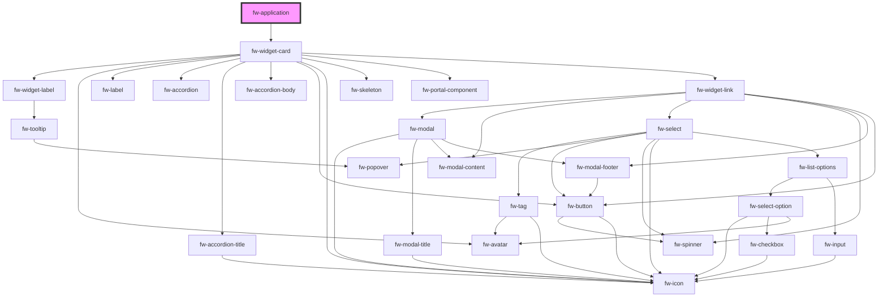

# fw-application

<!-- Auto Generated Below -->

## Properties

| Property          | Attribute          | Description | Type     | Default |
| ----------------- | ------------------ | ----------- | -------- | ------- |
| `applicationName` | `application-name` |             | `string` | `''`    |
| `componentId`     | `component-id`     |             | `string` | `''`    |
| `componentType`   | `component-type`   |             | `string` | `''`    |
| `params`          | `params`           |             | `any`    | `null`  |

## Methods

### `setValues(values: any) => Promise<void>`

#### Returns

Type: `Promise<void>`

### `trigger(componentId: any, params?: any) => Promise<any>`

#### Returns

Type: `Promise<any>`

## Dependencies

### Depends on

- [fw-widget-card](../widget-card)

### Graph

----------------------------------------------

*Built with [StencilJS](https://stenciljs.com/)*
