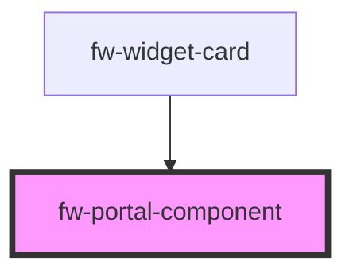

# fw-portal-component

<!-- Auto Generated Below -->

## Properties

| Property   | Attribute   | Description | Type     | Default    |
| ---------- | ----------- | ----------- | -------- | ---------- |
| `portalId` | `portal-id` |             | `string` | `'portal'` |
| `zIndex`   | `z-index`   |             | `string` | `'9005'`   |

## Dependencies

### Used by

 - [fw-widget-card](widget-card)

### Graph

----------------------------------------------

*Built with [StencilJS](https://stenciljs.com/)*
