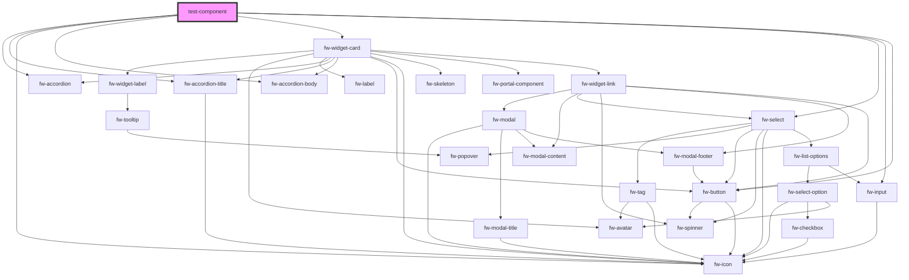

# test-component

<!-- Auto Generated Below -->

## Properties

| Property      | Attribute      | Description | Type     | Default |
| ------------- | -------------- | ----------- | -------- | ------- |
| `componentId` | `component-id` |             | `string` | `''`    |
| `params`      | `params`       |             | `any`    | `null`  |

## Methods

### `trigger(params: any) => Promise<{ response: { params: any; }; }>`

#### Returns

Type: `Promise<{ response: { params: any; }; }>`

## Dependencies

### Depends on

- fw-accordion
- fw-accordion-title
- fw-icon
- fw-accordion-body
- [fw-widget-card](widget-card)
- fw-select
- fw-input
- fw-button

### Graph

----------------------------------------------

*Built with [StencilJS](https://stenciljs.com/)*
