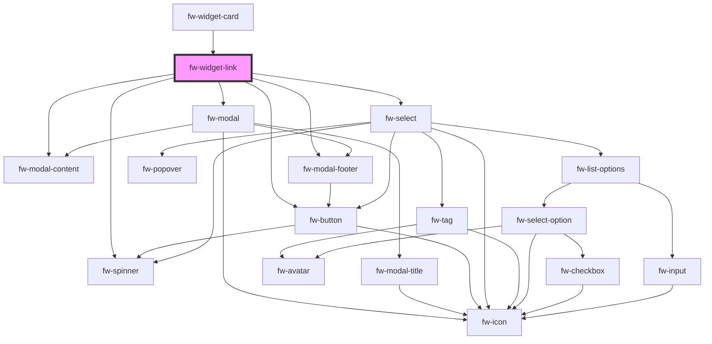

# fw-widget-link

<!-- Auto Generated Below -->

## Properties

| Property            | Attribute             | Description | Type     | Default     |
| ------------------- | --------------------- | ----------- | -------- | ----------- |
| `componentId`       | `component-id`        |             | `any`    | `undefined` |
| `entityLabel`       | `entity-label`        |             | `string` | `''`        |
| `fetchData`         | `fetch-data`          |             | `any`    | `undefined` |
| `linkFieldLabel`    | `link-field-label`    |             | `string` | `''`        |
| `linkFieldName`     | `link-field-name`     |             | `string` | `''`        |
| `params`            | `params`              |             | `any`    | `undefined` |
| `primaryFieldLabel` | `primary-field-label` |             | `string` | `''`        |

## Events

| Event     | Description | Type               |
| --------- | ----------- | ------------------ |
| `fwClose` |             | `CustomEvent<any>` |
| `fwLink`  |             | `CustomEvent<any>` |

## Dependencies

### Used by

 - [fw-widget-card](../widget-card)

### Depends on

- fw-modal
- fw-modal-content
- fw-select
- fw-spinner
- fw-modal-footer
- fw-button

### Graph

----------------------------------------------

*Built with [StencilJS](https://stenciljs.com/)*
