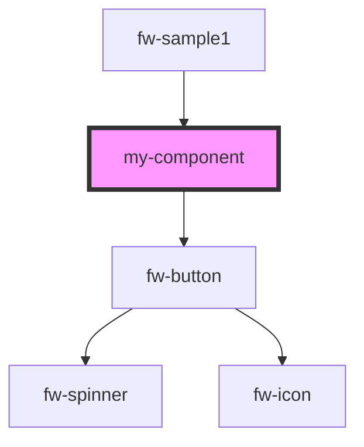

# my-component

<!-- Auto Generated Below -->

## Properties

| Property         | Attribute          | Description     | Type     | Default     |
| ---------------- | ------------------ | --------------- | -------- | ----------- |
| `first`          | `first`            | The first name  | `string` | `undefined` |
| `handleSendMess` | `handle-send-mess` |                 | `any`    | `undefined` |
| `last`           | `last`             | The last name   | `string` | `undefined` |
| `middle`         | `middle`           | The middle name | `string` | `undefined` |

## Events

| Event        | Description | Type               |
| ------------ | ----------- | ------------------ |
| `submitForm` |             | `CustomEvent<any>` |

## Methods

### `trigger(params: any) => Promise<{ response: { params: any; }; }>`

#### Returns

Type: `Promise<{ response: { params: any; }; }>`

## Dependencies

### Used by

 - [fw-sample1](../sample-component)

### Depends on

- fw-button

### Graph

----------------------------------------------

*Built with [StencilJS](https://stenciljs.com/)*
