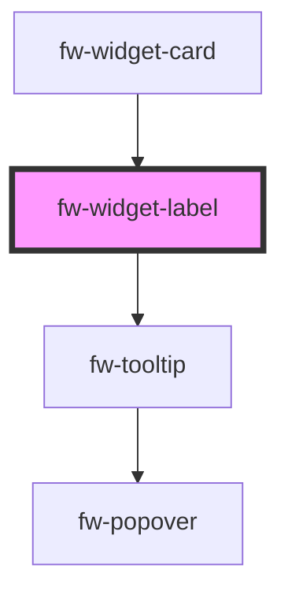

# fw-widget-label

<!-- Auto Generated Below -->

## Properties

| Property   | Attribute   | Description | Type                                                                   | Default    |
| ---------- | ----------- | ----------- | ---------------------------------------------------------------------- | ---------- |
| `label`    | `label`     |             | `string`                                                               | `''`       |
| `linkData` | `link-data` |             | `string`                                                               | `''`       |
| `type`     | `type`      |             | `"header" \| "label" \| "link" \| "section" \| "sublink" \| "subtext"` | `'header'` |

## Events

| Event           | Description | Type               |
| --------------- | ----------- | ------------------ |
| `fwAnchorClick` |             | `CustomEvent<any>` |

## Dependencies

### Used by

 - [fw-widget-card](../widget-card)

### Depends on

- fw-tooltip

### Graph

----------------------------------------------

*Built with [StencilJS](https://stenciljs.com/)*
