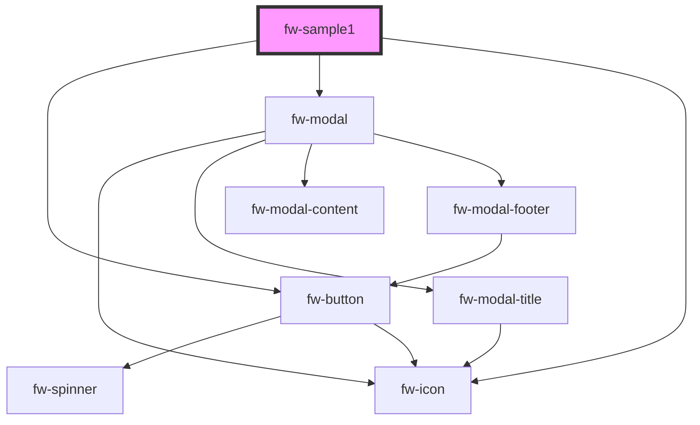

# fw-sample1

<!-- Auto Generated Below -->

## Properties

| Property   | Attribute   | Description | Type  | Default     |
| ---------- | ----------- | ----------- | ----- | ----------- |
| `appProps` | `app-props` |             | `any` | `undefined` |

## Methods

### `trigger(params: any) => Promise<{ response: { params: any; }; }>`

#### Returns

Type: `Promise<{ response: { params: any; }; }>`

## Dependencies

### Depends on

- fw-button
- fw-modal
- fw-icon

### Graph

----------------------------------------------

*Built with [StencilJS](https://stenciljs.com/)*
